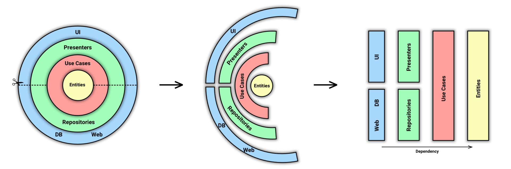
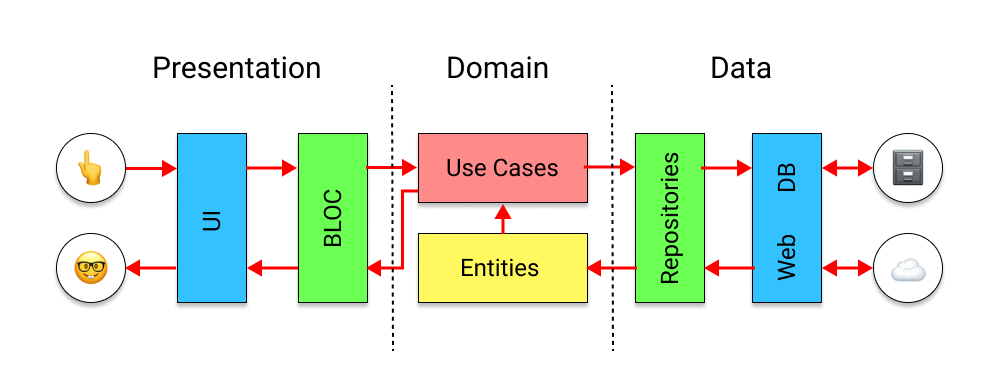
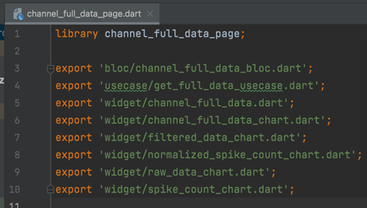
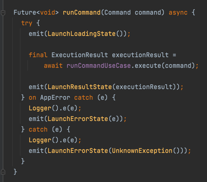
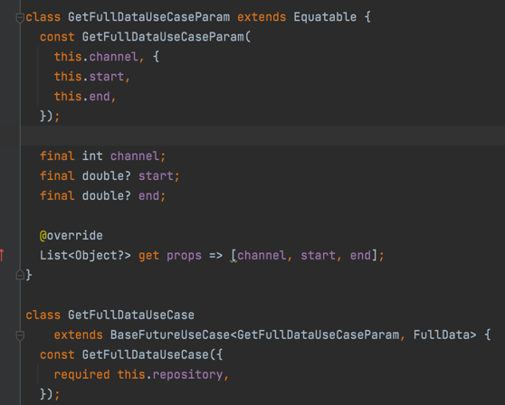
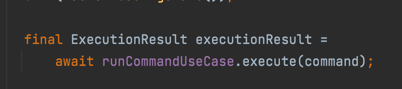
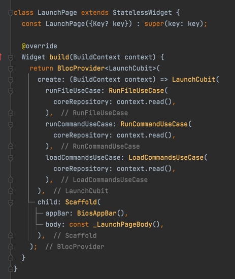

# Architecture
Inside the project we use some sort of Clean Architecture + Bloc.

## Presentation
`presentation.dart` library file should contain every page library.

### Screens
For each screen we have its' own folder.
For each screen should be created `***_page.dart` file with library what will export all screens' content.

Screen folder usually contain 3 inner folders:
* bloc
* usecase
* widget

#### Bloc
For each screen we have its' own bloc (or cubit). Bloc (cubit) doesn't have access to data layer. Communication with data layer works only through usecases.
Every usecase call should be wrapped with try-catch to handle errors;

#### Usecase
* Represents concepts of the business, information about the current situation and business rules.
* Usecase implements one of base usecases.
* If usecase needs 1 parameter, it's OK to set parameter type as generic, but if usecase needs 2 or more parameters, `**UseCaseParam` class should be created.

From bloc(cubit) usecase can be used with `execute` function.

#### Widgets

* Widgets should be logic-free. All possible business logic should be inside Bloc(Cubit).
* For every reusable widget should be created separate stateless/stateful widget.
* For `**Page` widget should be used `BlocProvider` 
* To communicate with Bloc(Cubit) any `flutter_bloc` widget or function can be used.

### Widgets

Every "global" reusable widget should be placed in this folder.

## Domain

* Yes, blocs(cubits) and usecases are part of Domain Layer in wide-meaning, but it's easier to use them in screens when it's near to the "context".
* Global (reusable) blocs and usecases should be placed in this folder.

### Models

* This folder contains Domain Layer models that are used inside Presentation Layer. Each model should be PODO (Plain Old Dart Object).
* Every model should extend `Equatable` to make easier to compare objects.
* Every model should be exported in `models.dart`

### Usecase

* Reusable usecases should be placed here

### Repository
* This folder contains repositories interfaces. That means that no implementation should be here.
* Repositories should use only domain models, no entities.

## Data

### Entity

Currently, we use gRPC, so all entities are generated.

### Mapper

* Mappers are used to map entity model to domain model inside the repository.
* Every mapper should implement `Mapper` interface.
* For each mapper we should have getter inside `MapperFactory`, since it is the easiest way to get mapper inside the repository.

### Repository implementation

* Every repository implements repository interface.
* **Repository** - The decision maker class when it comes to manage data CRUD operations. Operations can be done in this layer is caching mechanism, manage consecutive api calls etc…
* Inside repository different data sources can be used.
* **Remote data source** - Manage all server/external API calls.
* **Local data source** - Manage all local data storage: example SQLite implementation, Room, Realm…
* To map entity (response) model to domain model `MapperFactory` should be used.
* It's OK to use any utility that you need at this layer.

## Dependency Injection

* For Dependency Injection we use `Provider`.
* We have `Providers` class that includes providers for different utilities, repositories and services.

## Navigation
* For navigation, we use `AppNavitaion` extension where all `open***Page` should be placed.
* Inside the extension we have different helper functions from `BaseNavigation` extension that should be used to work with screens and dialogs.

## Config
`assets/.env` file is used for different environments configurations. This file is ignored by git (for security purposes), so you should create it or request it from your team lead.

# Roadmap
* [ ] ...
